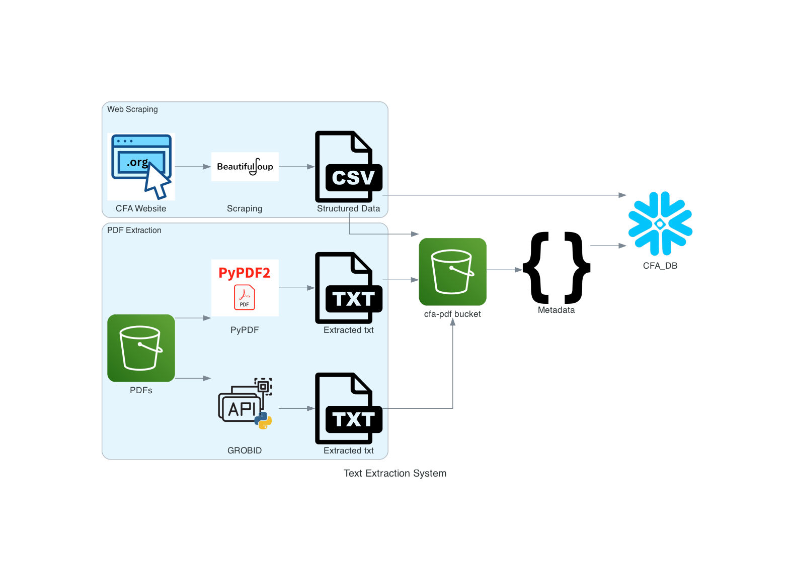

## Big Data Systems and Intelligence Analytics (DAMG 7245)

| Name         | Email                        | NUID    |
| ------------ | ---------------------------- | ------- |
| Ameya Apte   | apte.ame@northeastern.edu    | 2764540 |
| Sayali Dalvi | dalvi.sa@northeastern.edu    | 2799803 |
| Soeb Hussain | hussain.soe@northeastern.edu | 2747200 |

# Case_Study_2

# Finance Professional Development Resource Database

Big Data Systems and Intelligence Analytics (DAMG 7245) - Case_Study_2

## Overview

This project aims to aggregate and make accessible finance professional development materials through a comprehensive data engineering solution. It involves creating datasets from materials listed on the CFA Institute’s website, structuring the data, extracting text from PDF files, and integrating cloud storage solutions.

## Live application Links

[](https://codelabs-preview.appspot.com/?file_id=1_g3QZtY-Eae-6uYk91tGWhSfqPiM0bwwxelIrHwFKZY#0)

## Problem Statement

The task is to create two primary datasets from the 224 refresher readings listed on the Finance Institute's website and the topic outlines(attached PDF files). These readings are crucial for finance professionals looking to improve their finance skills. The datasets will serve as the backbone for an intelligent application designed for these professionals

## Features

- **Data Extraction**: Utilizes web scraping to gather finance-related materials.
- **Data Structuring**: Organizes scraped data into a coherent structure suitable for database integration.
- **Text Extraction**: Implements algorithms to extract text from PDF documents.
- **Cloud Integration**: Utilizes AWS S3 for storage and Snowflake for database management.

## Architecture Diagram



## Technologies Used

[](https://github.com/)
[](https://www.python.org/)
[](https://pypi.org/project/beautifulsoup4/)
[](https://www.selenium.dev/)
[](https://grobid.readthedocs.io/en/latest/Introduction/)
[](https://pypi.org/project/PyPDF2/)
[](https://www.snowflake.com/en/)
[](https://aws.amazon.com/s3/)

- Python for scripting and web scraping
- Jupyter Notebook for data analysis and visualization
- Snowflake for data storage and management
- AWS S3 for cloud-based file storage

## Data Sources

- [S3 Bucket](https://cfa-pdfs.s3.us-east-2.amazonaws.com/)
- [Finance Website](https://www.cfainstitute.org/en/membership/professional-development/refresher-readings#sort=%40refreadingcurriculumyear%20descending)

## Pre requisites

No specific prerequisites are required. Only installation of required packages needs to be done

## Project Structure

```
📦 Assignment2
├─ .DS_Store
├─ .gitignore
├─ LICENSE
├─ README.md
├─ code
│  ├─ .DS_Store
│  ├─ s3metadata.ipynb
│  ├─ task1_Web_Scraping_Dataset_Creation.ipynb
│  ├─ task2_PDF_extraction.ipynb
│  ├─ task3_Database_upload.ipynb
│  └─ task_4_cloud_storage_integration.ipynb
├─ data
│  ├─ .DS_Store
│  ├─ 2024-l1-topics-combined-2.pdf
│  ├─ 2024-l2-topics-combined-2.pdf
│  ├─ 2024-l3-topics-combined-2.pdf
│  └─ images
│     ├─ .DS_Store
│     ├─ 2.png
│     ├─ 3.png
│     ├─ 4.png
│     ├─ API.png
│     ├─ brackets-coding-icon.png
│     ├─ csv-file-icon.png
│     ├─ pypdf.png
│     ├─ soup.png
│     └─ txt-file-icon.png
├─ diagrams
│  ├─ Diagrams.ipynb
│  └─ architecture.png
├─ grobid_client_python
├─ requirements.txt
├─ sample_output
│  ├─ .DS_Store
│  ├─ 224_link.txt
│  ├─ FinanceHub.csv
│  ├─ Grobid
│  │  ├─ Grobid_RR_2024_l1_combined.txt
│  │  ├─ Grobid_RR_2024_l2_combined.txt
│  │  └─ Grobid_RR_2024_l3_combined.txt
│  ├─ PyPDF
│  │  ├─ PyPDF_RR_2024_l1_combined.txt
│  │  ├─ PyPDF_RR_2024_l2_combined.txt
│  │  └─ PyPDF_RR_2024_l3_combined.txt
│  └─ metadata_output.csv
└─ scripts
   ├─ 224LinkScrape.ipynb
   ├─ 224LinksScrape.py
   ├─ PyPDF.ipynb
   ├─ Web_Scrape.ipynb
   ├─ pypdf.py
   ├─ pypdf_v4.py
   ├─ s3Upload.ipynb
   └─ s3Upload_v2.py
```

_You can generate the project tree using following tools_
_[Project Tree Generator](https://woochanleee.github.io/project-tree-generator)_
_[Generate from terminal](https://www.geeksforgeeks.org/tree-command-unixlinux/)_

## How to run Application locally

### Setup and Installation

1. Clone the repository to your local machine.
2. Install the required Python libraries using `pip install -r requirements.txt`.
3. Configure AWS S3 and Snowflake with the provided setup guide.
4. Install selenium webdriver for edge browser - Download the edge webdriver file and set the Path in environment variables

Naming Conventions:

- s3 bucketname: CFA-PDFs
- snowflake DB: DAMG_7245_CFA
- snowflake warehouse: DAMG_7245_CFA
- Tables:
  - metadata: CFA_META_R
  - web scraped data: CFA_WEB_DATA_R

Execution Step for code/CSV2Snowflake.ipynb

- create a folder in parent directory with name 'config'
- add .env file in it containing following variables

```SNOWFLAKE_USER=''
SNOWFLAKE_PASSWORD=''
SNOWFLAKE_DATABASE='DAMG_7245_CFA_DB'
SNOWFLAKE_WAREHOUSE='DAMG_7245_WH_XS'
SNOWFLAKE_ACCOUNT_IDENTIFIER=''

GROBID_URL='http://localhost:8070/api/processFulltextDocument'
PDF_DIR_PATH='../data'
OUTPUT_DIR_PATH='../sample_output/'

S3_BUCKET_NAME = 'cfa-pdfs'
S3_PYPDF_FOLDER_NAME = 'pypdf'
S3_GROBID_FOLDER_NAME = 'grobid'
S3_ACCESS_KEY = ''
S3_SECRET_KEY = ''
S3_REGION=''
S3_META_BUCKET = 'cfa-pdfs'
S3_META_ACCESS_KEY = ''
S3_META_SECRET_KEY = ''
```

## References

- [S3 Documentation](https://docs.aws.amazon.com/s3/?icmpid=docs_homepage_featuredsvcs)
- [Snowflake Documentation](https://docs.snowflake.com/en/)
- [Grobid Documentation](https://grobid.readthedocs.io/en/latest/Introduction/)
- [CFA Institute's Website](https://www.cfainstitute.org/en/membership/professional-development/refresher-readings#sort=%40refreadingcurriculumyear%20descending)
